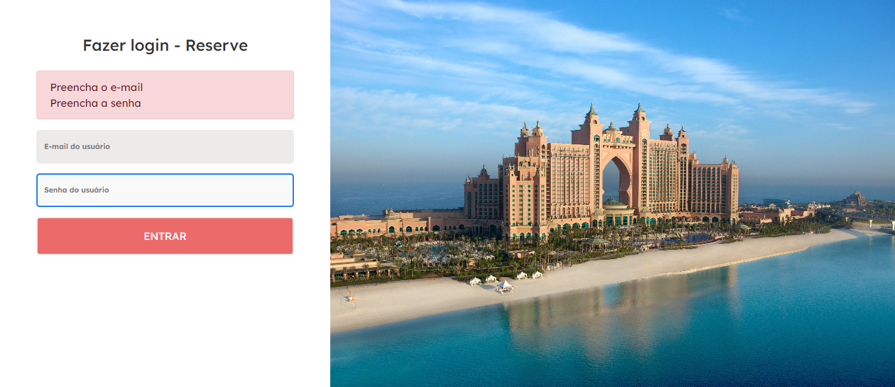

<h1 align="center">Sistema de Reserva de Hotel</h1><!--Nome curto e objetivo-->
<h5 align="center">Status: Em Andamento </h5><!--Concluido, Em andamento ou Finalizado-->

<h2>Sumário</h2>
<!--Sumário que leva as sessões do readme-->
<ul>
    <li><a href="#sobre">Sobre</a></li>
    <li><a href="#requisitosmacro">Requisitos macro</a></li>
    <li><a href="#demo">Demonstração da aplicação</a></li>
    <li><a href="#prereq">Pré-requisitos e como rodar a aplicação</a></li>
    <li><a href="#tec">Tecnologias utilizadas</a></li>
    <li><a href="#autor">Responsáveis</a></li>
</ul>

<h2 id="sobre">💻 Sobre</h2>
<!--Descrição do contexto e produto do projeto - Consulte o documento F001-NDSI-Levantamento de Macro Requisitos-->

O produto consiste em um sistema de reserva de hotel, em que há dois usuário, um hotel e outro cliente, o hotel é capaz de gerenciar os quartos do hotel se estão disponiveis ou não, já o usuário cliente consulta os quartos disponíveis.

Usuário hotel: login(hotel.h@gmail.com) | senha(123456) 

Usuário Cliente: login(cliente.c@gmail.com) | senha(123456) 

<h2 id="requisitosmacro">📝 Requisitos macro</h2>
<!--Lista de todos as funcionalidades do sistema (nível macro)-->
<ul>
    <li>Efetuar Login</li>
    <li>Consultar quartos disponíveis</li>
    <li>Atualizar status do quarto (disponível, indisponível)</li>
</ul>

<h2 id="demo">🎥 Demonstração da aplicação</h2>
<!--Conjunto de prints da aplicação-->
<h1 align="center">
    
</h1>

<h2 id="prereq">📀 Pré-requisitos e como rodar a aplicação</h2>
<!--Descrição do pré requisito de instalação na maquina em forma de passo a passo-->
<ol>
    <li>Instalar Angular CLI 13</li>
    <li>Instalar Node 16</li>
    <li>Instalar visual stuido code</li>
    <li>Clone o repositorio na maquína</li>
    <li>Insirá o comando <code>npm install</code> dentro do cmd na pasta do projeto</li>
    <li>Insirá o comando <code>ng serve</code para iniciar a aplicação em uma porta do localhost (geralmente é a 4200)</li>
</ol>

<h2 id="tec">🔨Tecnologias utilizadas</h2>
<!--Descrição das tecnologias utilizadas (linguagem, biblioteca, framework etc)-->

As seguintes ferramentas foram utilizadas na construção do projeto:

<ul>
    <li>Angular 13</li>
    <li>HTML</li>
    <li>CSS</li>
    <li>Typescript</li>
</ul>

<h2 id="autor">👦 Responsáveis</h2>
<!--Listagem dos responsáveis pelo projeto-->
<ul>
   <li>Patrick Guilherme</li>
   <li>João Pedro </li>
   <li>Natália</li>
<ul>
